# 3. Computer-Aided Design

## The Assignment
&nbsp;

- Model (raster, vector, 2D, 3D, render, animate, simulate, ...) a possible final project.

&nbsp;

## 2D Softwares - Raster and Vector
&nbsp;

### Krita
&nbsp;

{.center style="height:200px"} 

&nbsp;

[Krita](https://krita.org/en/) is a software for illustration creation, concept art, animation and it can also be used as photo editting tool. Krita works with [**raster images**](https://www.geeksforgeeks.org/vector-vs-raster-graphics/) what is a image that uses bits to store information. With more bits, more resolution we get from the image but more disk space the image will take up. 

I chose Krita to create, to refine, and to render my concept skecth presented in my [Principles and Practices](https://leonrosa.github.io/FabAcademy/Principles%20and%20Practices/) page. Here it is the steps I used sketch my project:

1. My first step was creating a sketch by hand.

    &nbsp;

    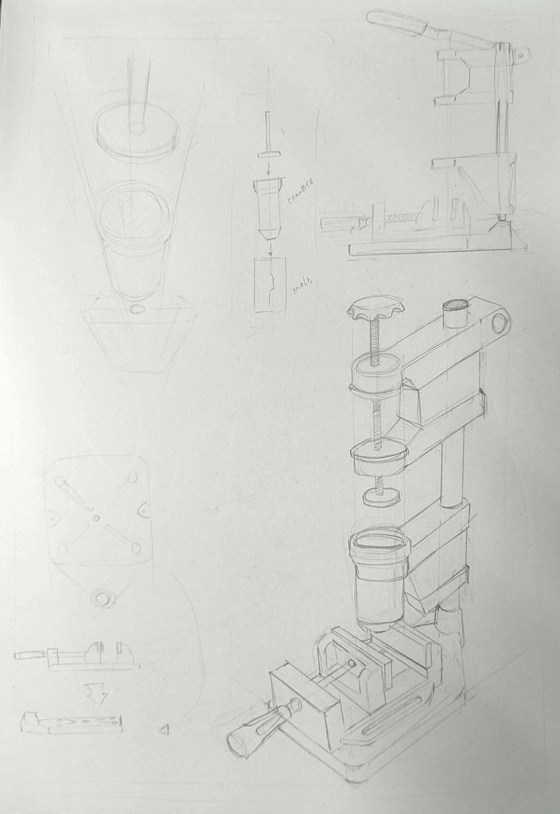{.center style="height:90vh"}

    &nbsp;

2. I took a picture of it and imported it into Krita. 

    &nbsp;

    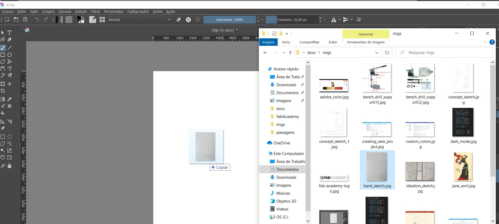{.center .image}

    &nbsp; 

3. Krita has features very similar to Photoshop where I can control layers to work on the drawing. Then I included the picture in my second layer, to use it as reference for my next steps.

    &nbsp;

    {.center .image}

    &nbsp; 

4. The next step was to start drawing over the picture to refine the sketch. Then I created one more layer over it.

    &nbsp;

    {.center .image}

    &nbsp; 

5. To make drawings in Krita, I used a [One by Wacom](https://www.wacom.com/pt-br/products/one-by-wacom). With the tablet connected, I could access the [Pop-up Palette](https://docs.krita.org/en/reference_manual/popup-palette.html) by pressing the brush icon and clicking a button on the tablet's pen. With the palette displayed, I chose the pencil brush to start the drawings.

    &nbsp;

    {.center .image}
    
    &nbsp; 

6. Then I started drawing over my first draft and correcting the perspective and lines with a tool called [Assitant Tool](https://docs.krita.org/en/reference_manual/tools/assistant.html), a set of rulers that helps with straight lines, ellipses and perpective drawings.

    &nbsp;

    {.center .image}

    &nbsp; 

7. I took advantage from the layer feature to create some components and align them with other details that already had been drawn before.

    &nbsp;

    {.center .image}

    &nbsp; 

8. Finally, I repeated this process of overlaying the drawing on the draft with the pencil brush until I get the following result:

    &nbsp;

    {.center style="height: 90vh"}

    &nbsp; 

**References:** For fullfilling this concept sketch with Krita, I needed some help with a few tools. Here it is the videos I watched to get some orientation towards them:

- **Importing Images into Krita:** <https://www.youtube.com/watch?v=2aqrGjwndiU>
- **Assistant Tool:** <https://www.youtube.com/watch?v=Tu463N_9gwY>
- **Eraser Tool:** <https://www.youtube.com/watch?v=tHgJvNKjquk>
- **Pop-up Palette Customization:** <https://www.youtube.com/watch?v=g2QEFQ16iiM>

&nbsp;
### Inkscape
&nbsp;

{.center style="height:200px"}

&nbsp; 

I used the [Inkscape](https://inkscape.org/pt-br/) software to develop a logo for my documentation site. Inkscape is a software that use vectors to build illustrations and drawings. [Vectors graphics](https://www.geeksforgeeks.org/vector-vs-raster-graphics/) are lines or shapes build by sequencial commands or mathematical statements. Those graphics have the advantage of keeping the resolution and quality no matter its size, performing as a great tool to develop a logo for the project.

Here are the steps used for the logo development:

1. First of all, I needed to use a image as reference to develop the logo. To do that I imported to **Microsoft Paint**, a native illustration software from Windows, the concept sketch developed in Krita and cutted the sideview using the selection tool.

    &nbsp;
    
   
    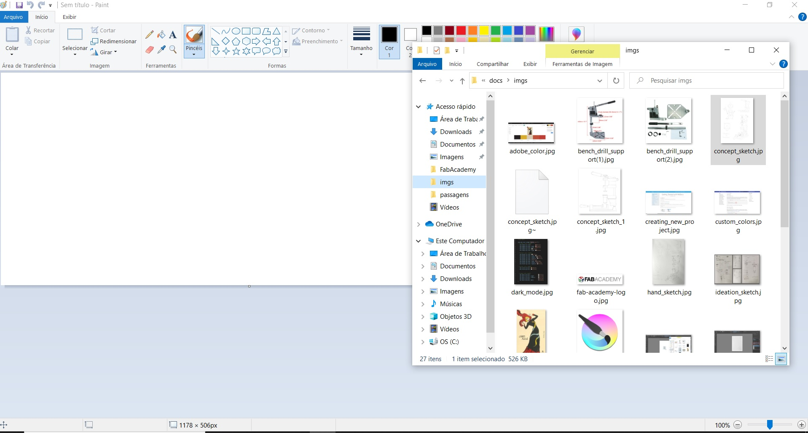{.center .image}
    
    &nbsp; 

    {.center .image}

    &nbsp; 

3. I used a tool called **Bezier** to draw over the image.

    &nbsp; 

    {.center .image}

    &nbsp; 

    {.center .image}

    &nbsp; 

4. With the Bezier tool I created the shapes referring to each components.

    &nbsp; 

    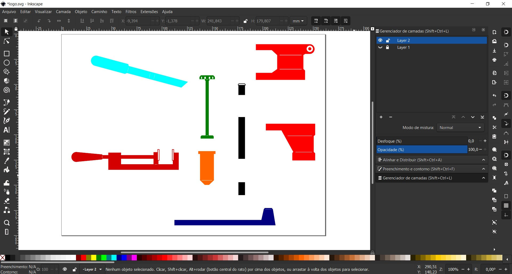{.center .image}

    &nbsp; 

5. I assembled the shapes by dragging them and positioining them according to the reference image. The result looked like this:

    &nbsp; 

    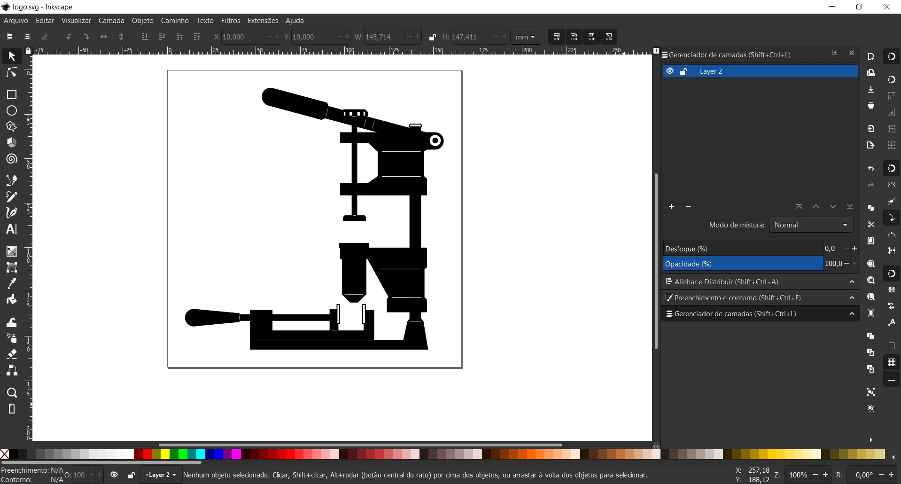{.center .image}
    
    &nbsp; 

6. I created a frame around the vector drawing using the **circle tool**.

    &nbsp; 

    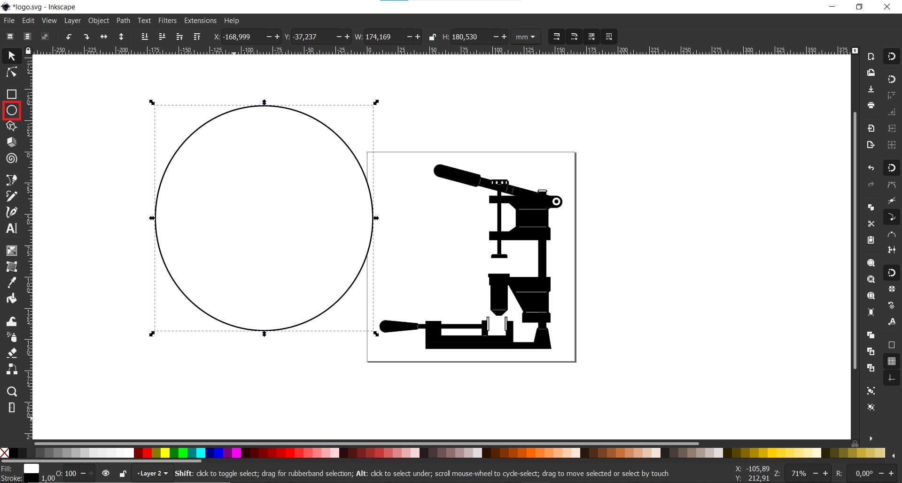{.center .image}

    &nbsp;

8.  With the circle geometry selected, I changed the stroke width by 5mm in the **Fill and Stroke** feature, inside the **Stroke Style** tab

    &nbsp; 

    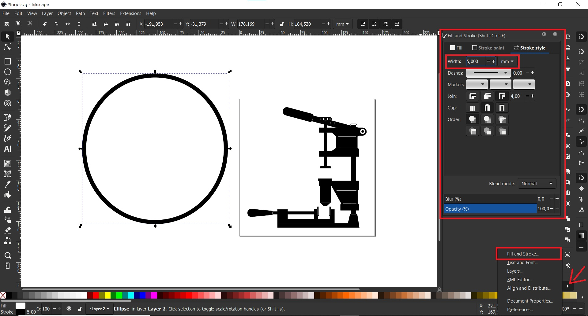{.center .image}

    &nbsp;

9. I centralized the circle with the drawing using the **Center on Vertical Axis** and **Center on Horizontal Axis** in the **Align and Disttribute** feature.

    &nbsp; 

    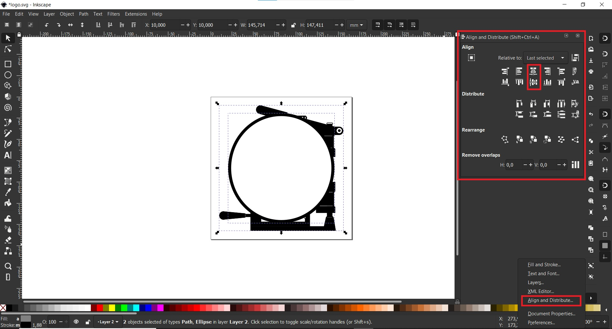{.center .image}

    &nbsp;

10. I sent the circle back to the drawing and adjusted the size of the circle.

    &nbsp; 

    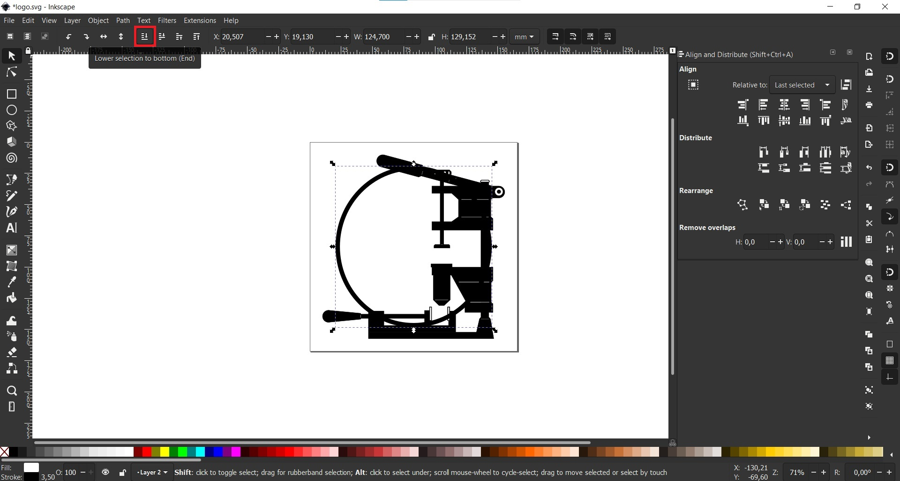{.center .image}

    &nbsp;
    
    {.center .image}

    &nbsp;

11. Finally the logo will look like the image below:

    &nbsp; 

    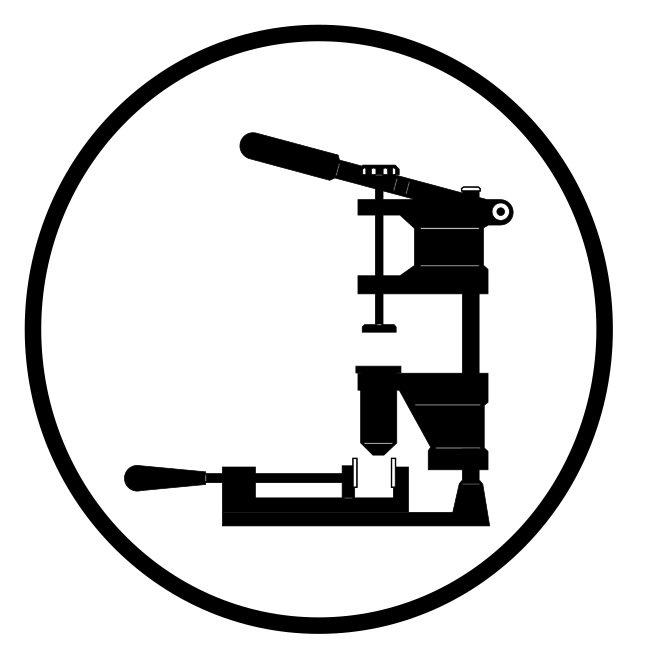{.center style="height:90vh"}

    &nbsp;

 

&nbsp;
## 3D Softwares 

### Autodesk Fusion 360
&nbsp;

{.center style="height:200px"}

&nbsp;

[Autodesk Fusion 360](https://www.autodesk.com/products/fusion-360/overview) is the software I chose for modeling my plastic injector. Here it is the steps I followed to build my digital model:

1. I brought the same image used in the Inkscape to Fusion by insertting a canvas into the workspace.

    &nbsp; 

    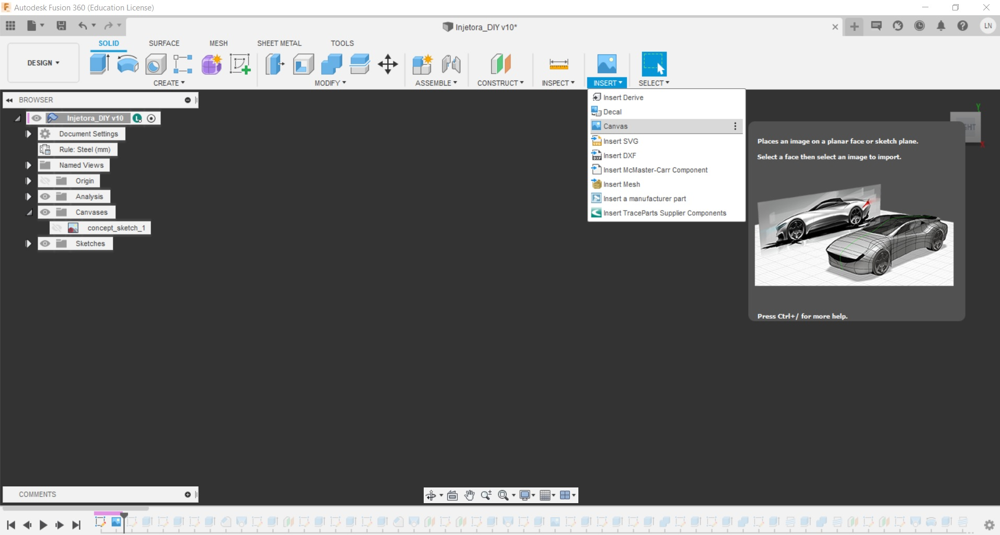{.center .image}

    &nbsp; 

2. Then the software asked me which plan I wanted to place the canvas. I placed it in the ZY plane.

    &nbsp; 

    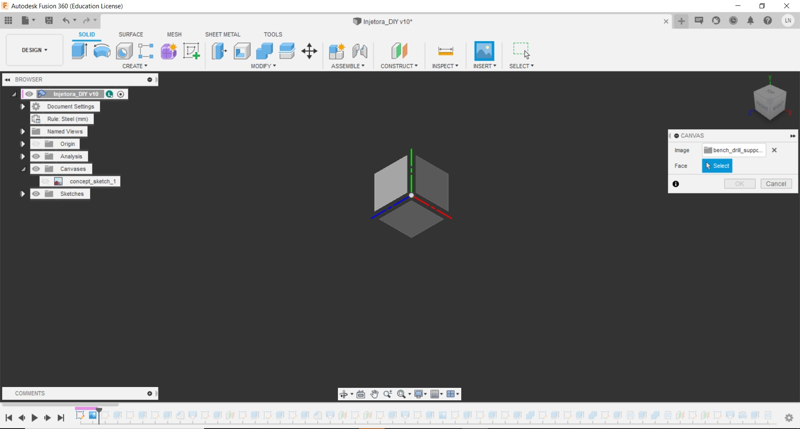{.center .image}

    &nbsp; 

3. With the canvas placed, it is possible to model over it. Analogous process to the one used in the process with Krita.

    &nbsp; 

    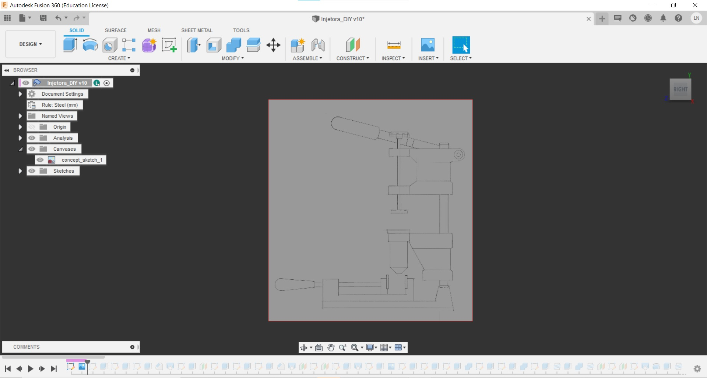{.center .image}

    &nbsp; 

5. I started creating a sketch over the canvas. 

    &nbsp; 

    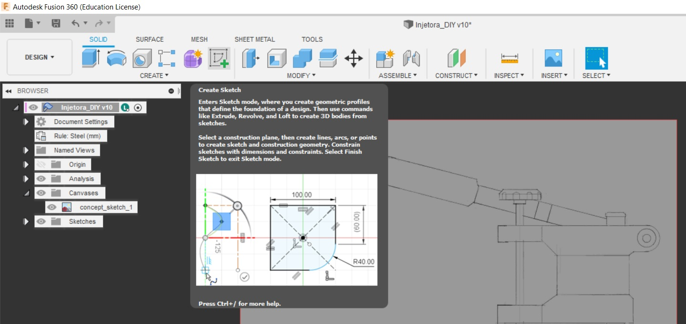{.center .image}

    &nbsp; 

6. With the following tools (line, rectangle and circle) I created the profile, in ZX plane, according to the canvas dimensions. I also used the **sketch dimension tool** to define the measures of the geometry.

    &nbsp; 

    {.center .image}

    &nbsp; 

    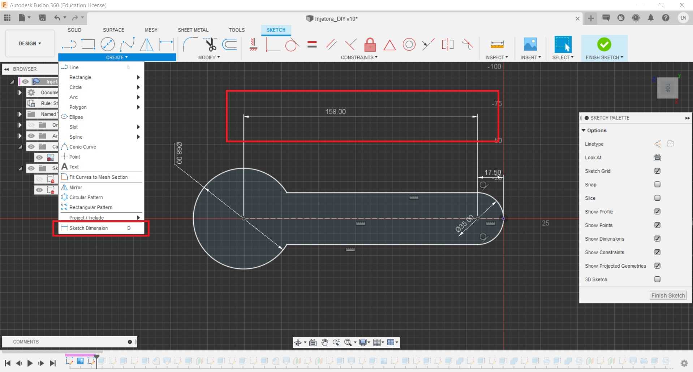{.center .image}

    &nbsp; 

7. I extruded the profile with the **Extrude Tool** with the right height dimension, following again the reference from canvas.

    &nbsp; 

    {.center .image}

    &nbsp; 

8. Then I repeated the same process of sketching and extruding, now in the ZY plane.

    &nbsp; 

    {.center .image}

    &nbsp; 

    {.center .image}

    &nbsp; 

9. I repeat this two operation one more time. But the extrude operation was used as a cut tool, to create the side profife of the component.

    &nbsp; 

    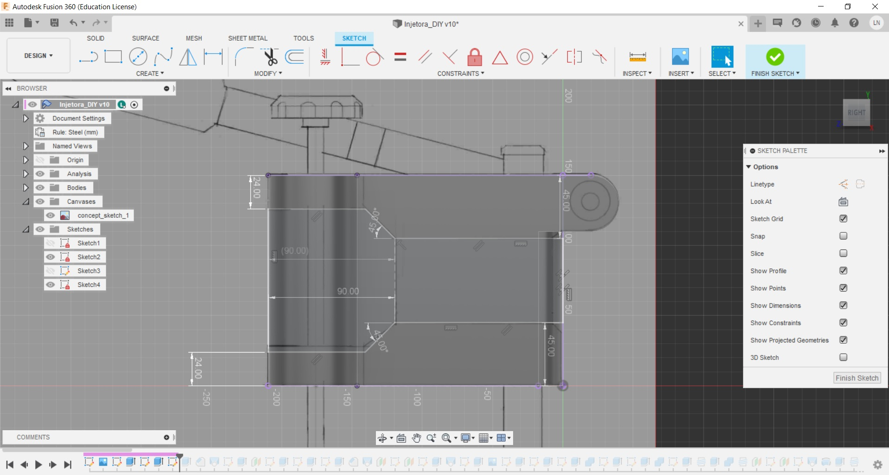{.center .image}

    &nbsp; 

    {.center .image}

    &nbsp; 

10. I used the **Chamfer Tool** to create a chamfer the corners of the two parts remaining after the cut.

    &nbsp; 

    {.center .image}

    &nbsp; 

    {.center .image}

    &nbsp; 

11. Then I used the **Loft Tool** to close the geometry by selecting the two profiles shaded in blue.

    &nbsp; 

    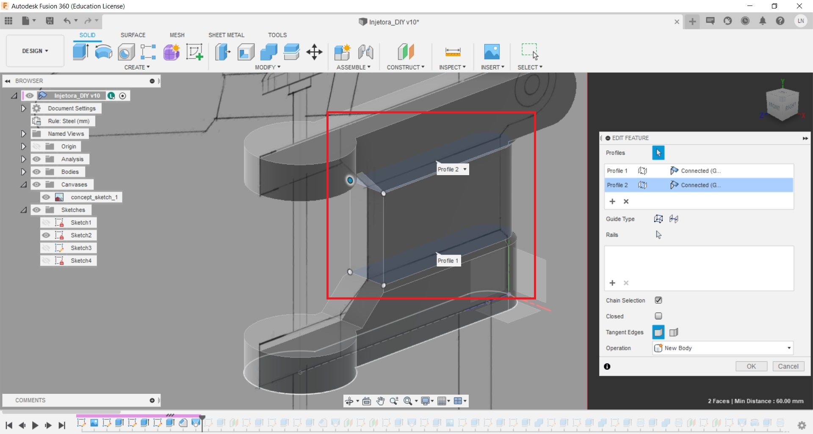{.center .image}

    &nbsp; 

12. I repeated this process to build the other components of my project. For the thread responsible to push the plastic into the chamber and the thread from the vise I needed to build a cylinder. Once again I drawed a circle as profile for extrusion.

    &nbsp; 

    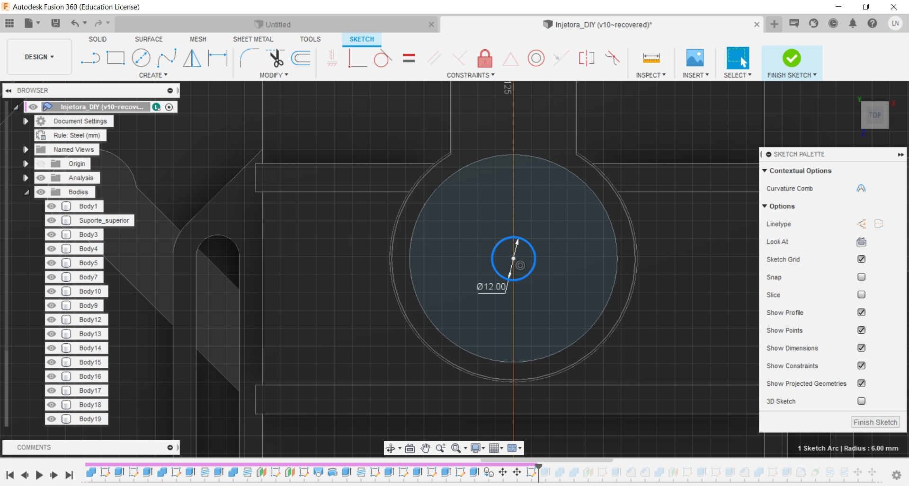{.center .image}

    &nbsp; 

    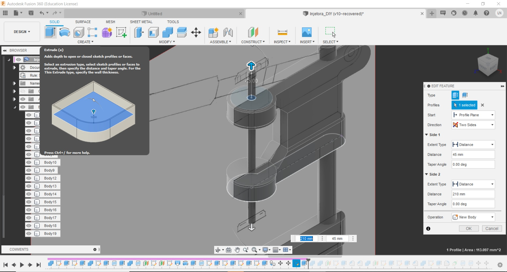{.center .image}

    &nbsp; 

13. Then I created a thread with the **Thread Tool** by selecting the side surface from the body.

    &nbsp; 

    {.center .image}

    &nbsp; 

    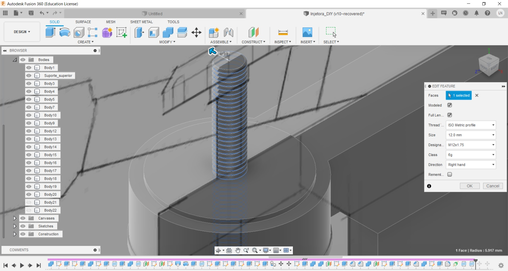{.center .image}

    &nbsp; 

14. The result of the 3D modeling using those tools (sketch, extrude, loft and thread) looked like this:

    &nbsp; 

    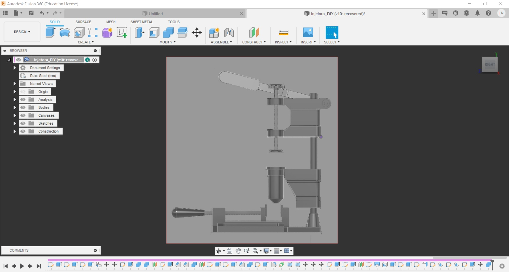{.center .image}

    &nbsp; 

    {.center .image}

    &nbsp; 

### Tinkercad
&nbsp;

{.center style="height:200px"}

&nbsp;

In the Tinkercad, another 3D software from Autodesk which work in the browser and does not need to be installed, I modeled the PID controller enclosure. Here it is the steps:

1. In the Fusion 360 I selected the upper part of the plastic injector with the right button of the mouse and exported it as a STL file.

    &nbsp; 

    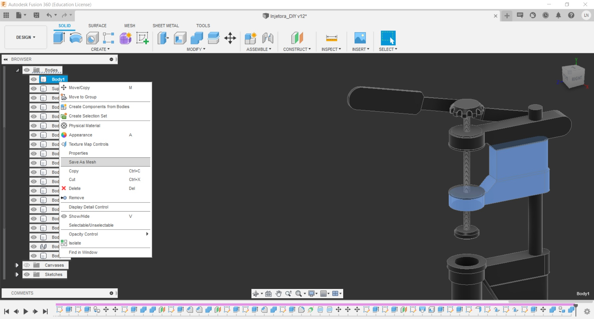{.center .image}

    &nbsp; 

    {.center .image}

    &nbsp; 

2. With Tinkercad opened, I imported the STL file by clicking over the button located at the upper right side of the interface. After that, the software asked me to select the file you want to import by dragging it over the specified area. 

    &nbsp; 

    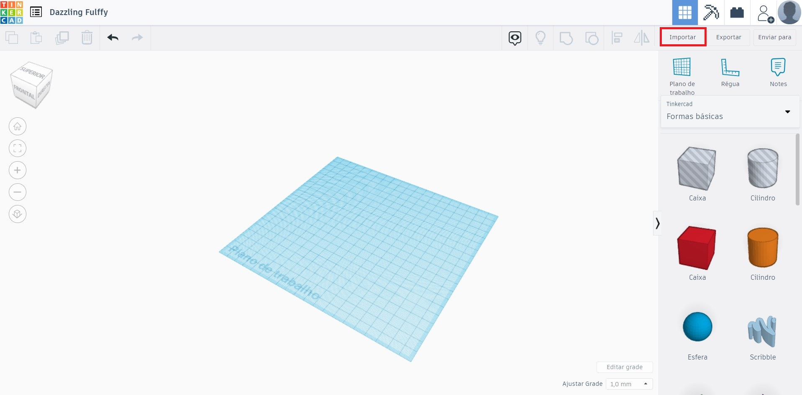{.center .image}

    &nbsp; 

    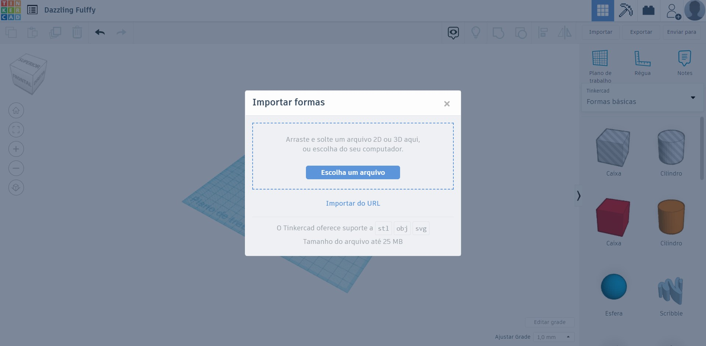{.center .image}

    &nbsp; 

3. Another window will appear where I set up the unities of measuments and the size of the model. In this case, I selected milimeters and kept the model size.

    &nbsp; 

    {.center .image}

    &nbsp; 

4. With the model imported I adjusted the positioning the model to be able to work with it as I wanted.

    &nbsp; 

    {.center .image}

    &nbsp; 

5. At the right side of the interface, I chose a cube and positioned it next to upper part of the plastic injector.

    &nbsp; 

    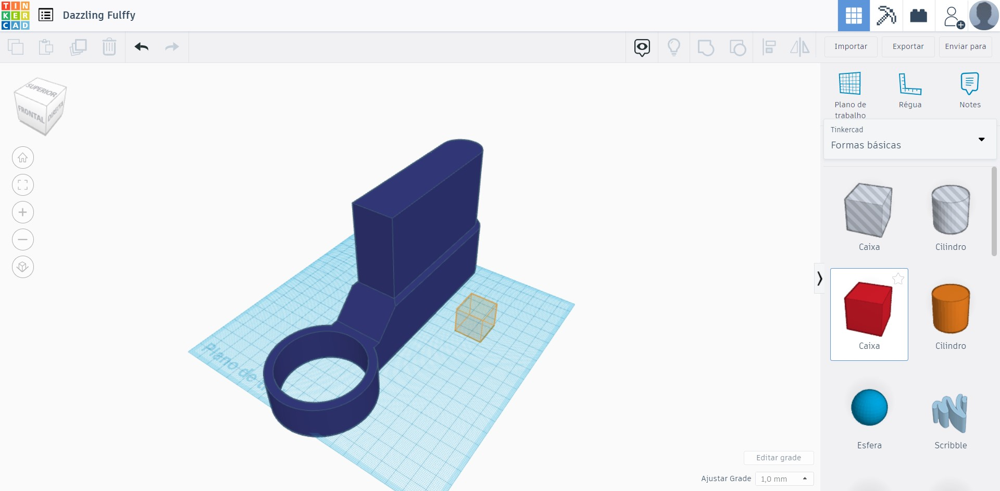{.center .image}

    &nbsp; 

6. Clicking over the cube, I dragged the blacked quare dots resizing the object according to the following dimensions.

    &nbsp; 

    {.center .image}

    &nbsp; 

    {.center .image}

    &nbsp; 

    &nbsp; 

    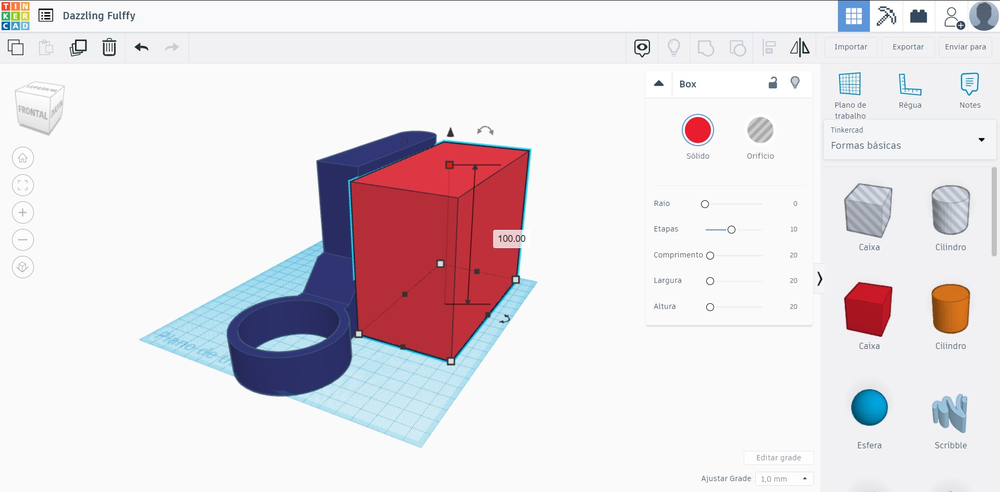{.center .image}

    &nbsp;  

7. I created another cube and I repeated the process resizing the object according to the images below. 

    &nbsp; 

    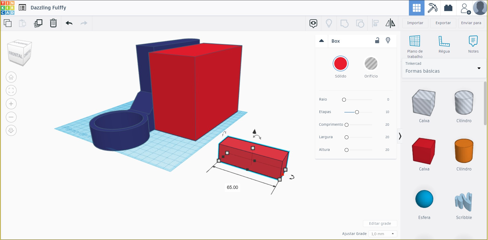{.center .image}

    &nbsp; 

8. I aligned both objects and moved the smaller prism 50mm along to z axis.

    &nbsp; 
    
    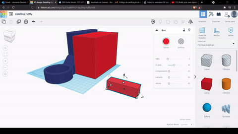{.center .image}

    &nbsp; 

    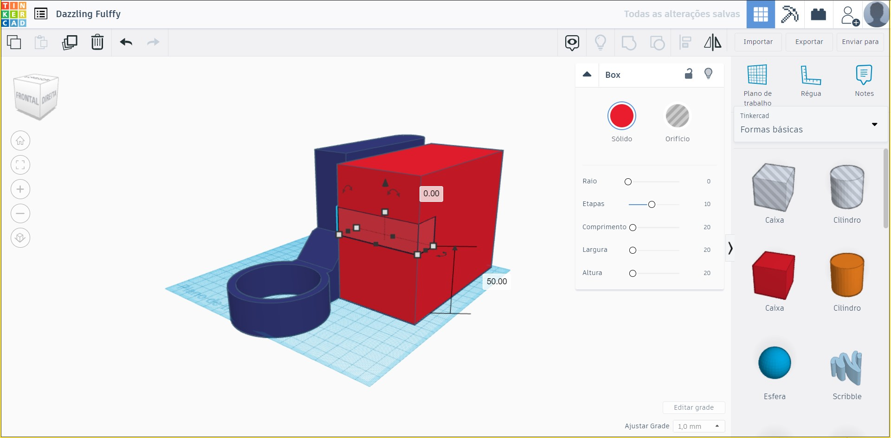{.center .image}

    &nbsp; 

9. I stretched the small prism to its body cross over the PID body. I displayed it as a **Hole** and I used the **Group** feature to cut the model.

    &nbsp; 

    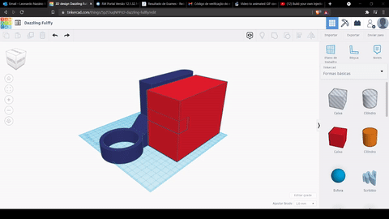{.center .image}

    &nbsp; 

10. Then I created a wedge and repeated the last 3 steps to create a new cut on the enclosure body, to create a diagonal finishing at its upper side.

    &nbsp; 

    {.center .image}

    &nbsp; 

11. Now I need to create a shel from this body. I duplicated the object by pressing **Ctrl+D**, displayed it as a hole, and resized it to be 3mm less in each side of the body.

    &nbsp; 

    {.center .image}

    &nbsp; 

12. I created another cube as a hole, resized it and positioned it as a prolongation of the hole.

    &nbsp; 

    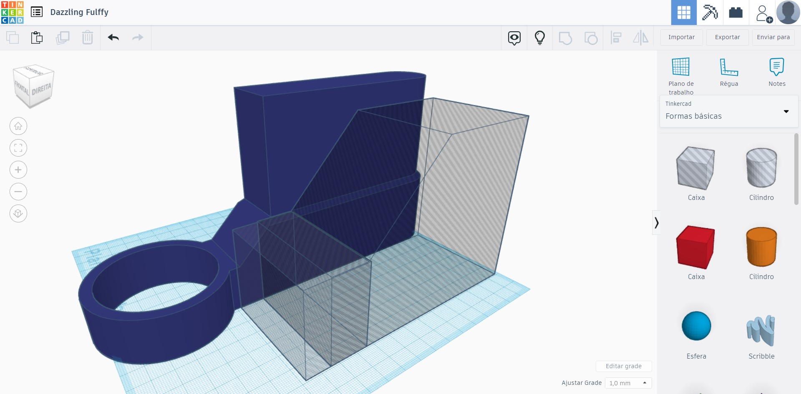{.center .image}

    &nbsp; 

13. Grouping those two hole objects with the enclosure, I got the following result.

    &nbsp; 

    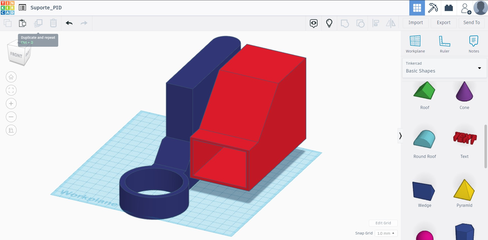{.center .image}

    &nbsp; 

14. Following the same features and process presented before, I created a representation of the PID panel.

    &nbsp; 

    {.center .image}

    &nbsp; 

15. Finally I exported a new STL mesh from the Tinkercad and imported again into Fusion, positioning the enclosure with the plastic injector body.

    &nbsp;

    {.center .image}

    &nbsp; 

    

    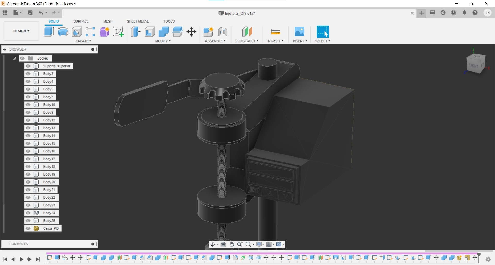{.center .image}
    

    &nbsp; 