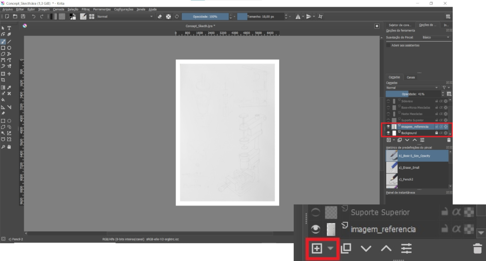

# 3.Computer-Aided Design

## The Assignment
&nbsp;

- Model (raster, vector, 2D, 3D, render, animate, simulate, ...) a possible final project.

&nbsp;

## 2D Softwares - Raster and Vector
&nbsp;

### Krita
&nbsp;

{style="height:200px"} 

&nbsp;

[Krita](https://krita.org/en/) is a software for illustration creation, concept art, animation and it can also be used as photo editting tool. Krita works with [**raster images**](https://www.geeksforgeeks.org/vector-vs-raster-graphics/) what is a image that uses bits to store information. With more bits, more resolution we get from the image but more disk space the image will take up. 

I chose Krita to create, to refine, and to render my concept skecth presented in my [Principles and Practices](https://leonrosa.github.io/FabAcademy/Principles%20and%20Practices/) page. Here it is the steps I used sketch my project:

1. My first step was creating a sketch by hand.

    &nbsp;

    

    {style="height:600px"}
    

    &nbsp;

2. I took a picture of it and imported it into Krita. 

    &nbsp;

    

    {style="width:950px"}
    

    &nbsp; 

3. Krita has features very similar to Photoshop where I can control layers to work on the drawing. Then I included the picture in my second layer, to use it as reference for my next steps.

    &nbsp;

    

    {style="width:950px"}
    

    &nbsp; 

4. The next step was to start drawing over the picture to refine the sketch. Then I created one more layer over it.

    &nbsp;

    

    {style="width:950px"}
    

    &nbsp; 

5. To make drawings in Krita, I used a [One by Wacom](https://www.wacom.com/pt-br/products/one-by-wacom). With the tablet connected, I could access the [Pop-up Palette](https://docs.krita.org/en/reference_manual/popup-palette.html) by pressing the brush icon and clicking a button on the tablet's pen. With the palette displayed, I chose the pencil brush to start the drawings.

    &nbsp;

    

    {style="width:950px"}
    

    &nbsp; 

6. Then I started drawing over my first draft and correcting the perspective and lines with a tool called [Assitant Tool](https://docs.krita.org/en/reference_manual/tools/assistant.html), a set of rulers that helps with straight lines, ellipses and perpective drawings.

    &nbsp;

    

    {style="width:950px"}
    

    &nbsp; 

7. I took advantage from the layer feature to create some components and align them with other details that already had been drawn before.

    &nbsp;

    

    {style="width:550px"}
    

    &nbsp; 

8. Finally, I repeated this process of overlaying the drawing on the draft with the pencil brush until I get the following result:

    &nbsp;

    

    {style="height:600px"}
    

    &nbsp; 

**References:** For fullfilling this concept sketch with Krita, I needed some help with a few tools. Here it is the videos I watched to get some orientation towards them:

- **Importing Images into Krita:** <https://www.youtube.com/watch?v=2aqrGjwndiU>
- **Assistant Tool:** <https://www.youtube.com/watch?v=Tu463N_9gwY>
- **Eraser Tool:** <https://www.youtube.com/watch?v=tHgJvNKjquk>
- **Pop-up Palette Customization:** <https://www.youtube.com/watch?v=g2QEFQ16iiM>

