## Group Assignment

&nbsp;

Characterize your lasercutter's focus, power, speed, rate, kerf, joint clearance and types

&nbsp;

### Material
&nbsp;

- 3mm MDF (Medium-density fibreboard) sheet.

&nbsp;

{.center style="width:950px"}

&nbsp;

### Sofware
&nbsp;

The laser cutter machine is [Duplotech 1080](https://www.insper.edu.br/fab-lab/equipamentos/) from [Duplo J](http://www.duploj.com.br/) and its software is called [RDWorks (RDCAM)](http://www.duploj.com.br/suporte). It can support `.dxf` and `.bitmap` files. 

&nbsp;

{.center style="width:950px"}

&nbsp;

### Focus
The laser cutter has a manual focus. According to the manufacturer's instructions, the distance between the material surface and the laser nozzle must be 6 mm. Therefore, we placed a 6 mm thickness piece of acrylic between the MDF sheet and the laser nozzle (the two screws highlighted in the picture below can be handled to allow the cannon to be free or fixed).

&nbsp;

{.center style="width:950px"}

&nbsp;

### Setting Test (power, speed, rate)
To get a better sense of what the best parameters are for cutting and engraving we developed two tests, one of power(%) vs speed(mm/s) for testing cutting parameters and another one with interval(mm) vs power(%) using a fixed speed of 350mm/s to test engraving parameters. We set different parameters up divided by colors.

You can download the setting test file [here](4Downloads/Setting_test.dxf).

&nbsp;

{.center style="width:950px"}

&nbsp;

{.center style="width:950px"}

&nbsp;

{.center style="width:480px"}

&nbsp;

|**The results after cutting and engraving in 3mm MDF**|
|:------------------------------------------------:|
|{.center style="width:950px"}|

&nbsp;

### Kerf Test
&nbsp;

In this file were drawn some 15 mm diameter circles. Each color was set up with a different power (%). And the first row was cut with a speed of 5 mm/s and the second 15 mm/s.

You can download the kerf test file [here](4Downloads/Kerf_test.dxf).
&nbsp;

{.center style="width:950px"}

&nbsp;

{.center style="width:950px"}

&nbsp;

There isn’t that much of difference changing the parameters. The calculated kerf is around ***0.225mm*** and ***0.275mm***.
&nbsp;

{.center}

&nbsp;

### Joint Clearance Test
&nbsp;

Setting Values: power 70%, speed 15mm/s.

You can download the joint clearance test file [here](4Downloads/Join test.dxf).
&nbsp;

{.center style="width:950px"}

&nbsp;

{.center style="width:950px"}

&nbsp;

{.center style="width:480px"}

&nbsp;

{.center style="width:950px"}

&nbsp;

The gap which had the best fit was 2.75mm (kerf around 0,25mm).
&nbsp;

{.center style="width:950px"}

&nbsp;

## Individual Assignment

&nbsp;

- Design, lasercut, and document a parametric **press-fit construction kit**, which can be assembled in multiple ways. Account for the lasercutter kerf.

- Cut something on the vinylcutter.
&nbsp;

### Press-fit Construction Kit
&nbsp;

My kit is based on [Kellie Dunn's press-fit construction kit](https://kelliead.github.io/assignment1.html). Through her files I could import her design in Fusion 360 and work over it.

&nbsp;

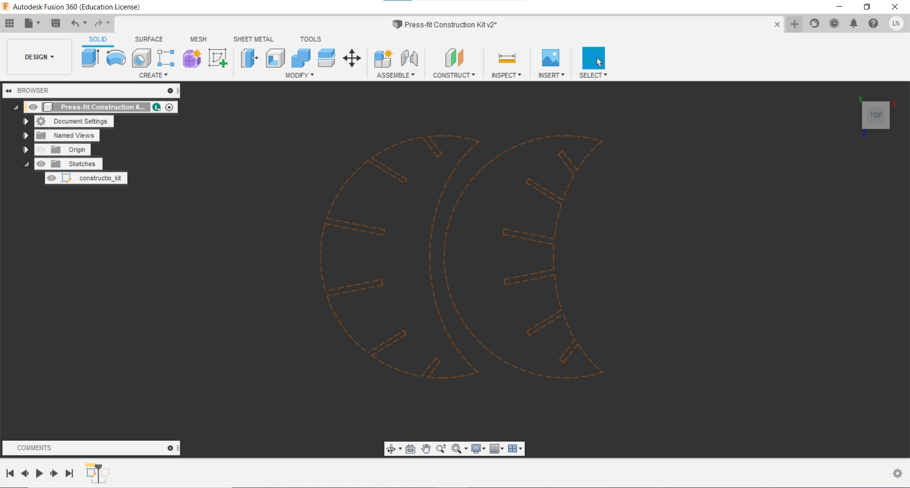{.center style="width:950px"}

&nbsp;

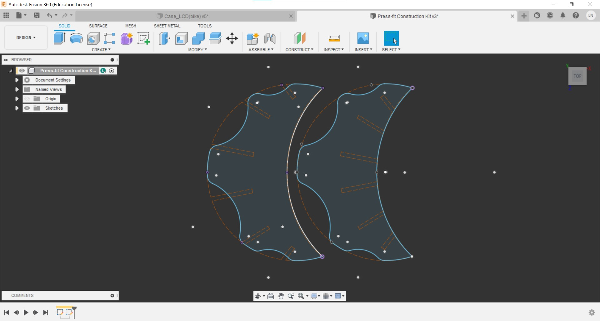{.center style="width:950px"}

&nbsp;

Kellie Dunn's used cardboard sheet to produce the pieces that constitute her kit. In my case, since I used 3mm MDF sheets, I needed to adjust the cuts for the press-fit. To create the cuts according to what I planned, I modeled and positioned all the pieces as I had envisioned.

&nbsp;

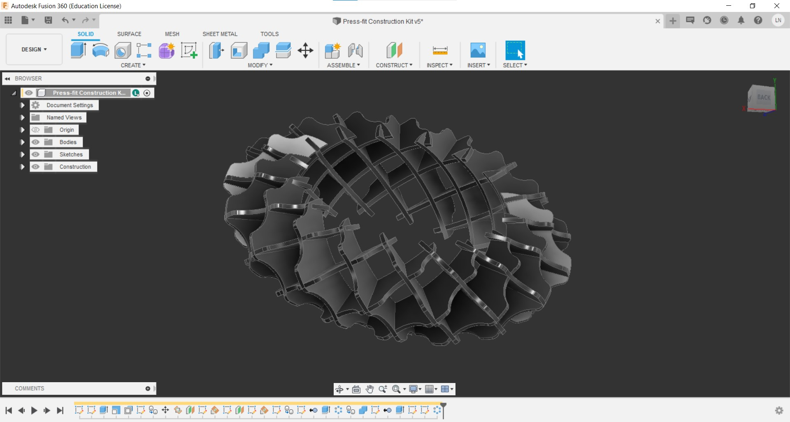{.center style="width:950px"}

&nbsp;

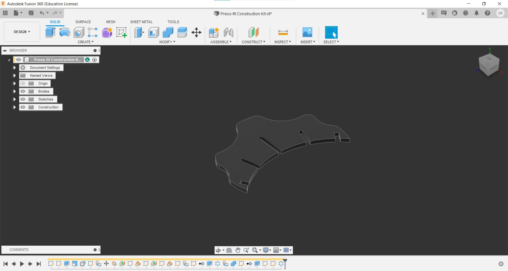{.center style="width:950px"}

&nbsp;

After modeling the pieces, I exported its sketch as a `.dxf` file and brought it in **RDWorks**. I positioned all the 32 pieces according to the size of MDF sheets I had avaiable. Since I was using scraps of sheets, I organized it in small groups like the image below:

&nbsp;

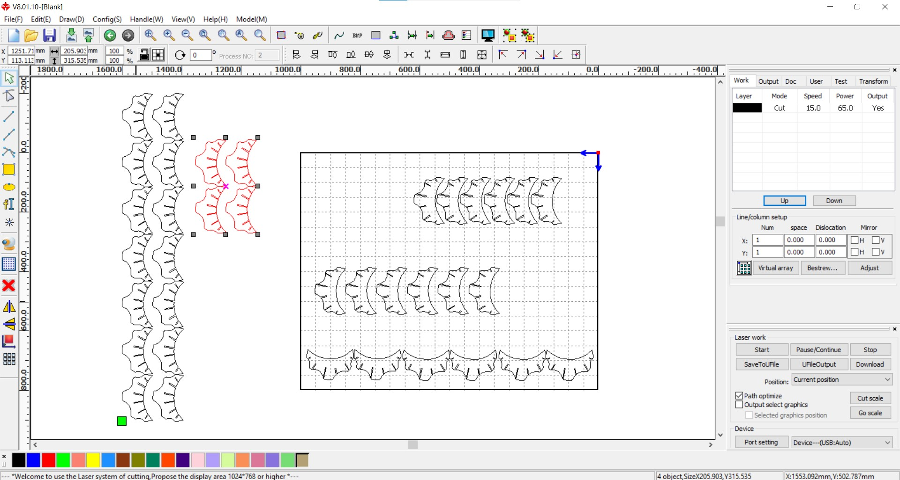{.center style="width:950px"}

&nbsp;

From **RDWorks** I sent the drawings as a cut file to the laser cutter and started the process of fabrication of the pieces. The images below show the results and the kit assembling process. 

&nbsp;

{.center style="width:950px"}

&nbsp;

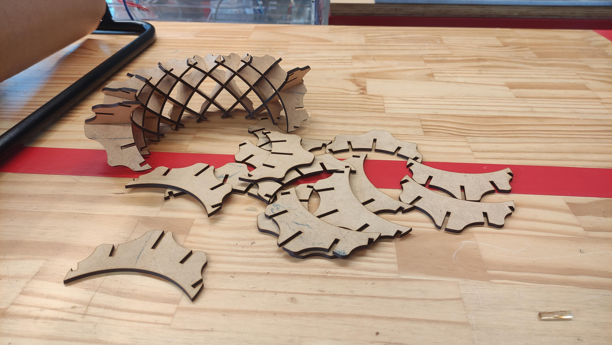{.center style="width:950px"}

&nbsp;

{.center style="width:950px"}

&nbsp;

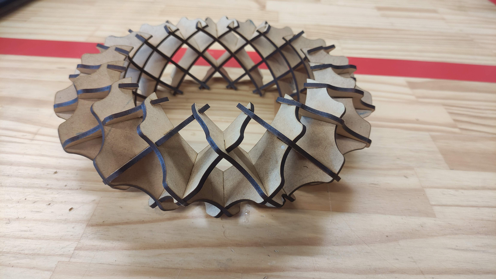{.center style="width:950px"}

&nbsp;

### Vinyl Cutter Assignment
&nbsp;

For the vinyl cutter exercise, I used the logo developed through Inkscape in the [Computer-Aided Design assingment](https://leonrosa.github.io/FabAcademy/Computer-Aided%20Design/#inkscape) to create a sticker . But before sending the logo to the machine, I needed to adjust the size of the image according to the size I wanted for the sticker. I did it changing the values, in millimeters, described in the boxes in the upper side of the Inkscape interface. The **H** means "height" and the **W** means "width".

&nbsp;

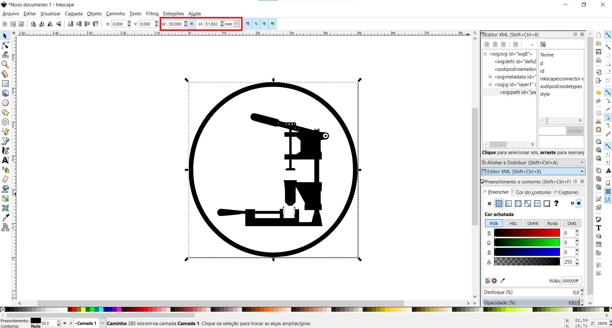{.center style="width:950px"}

&nbsp;

After rezising the logo as I wanted, I saved it in a `.pdf`file.

&nbsp;

{.center style="width:950px"}

&nbsp;

{.center style="width:950px"}

&nbsp;

I connected my lap top with the vinyl cutter machine using a USB cable and placed a scrap of vinyl in the machine.

&nbsp;

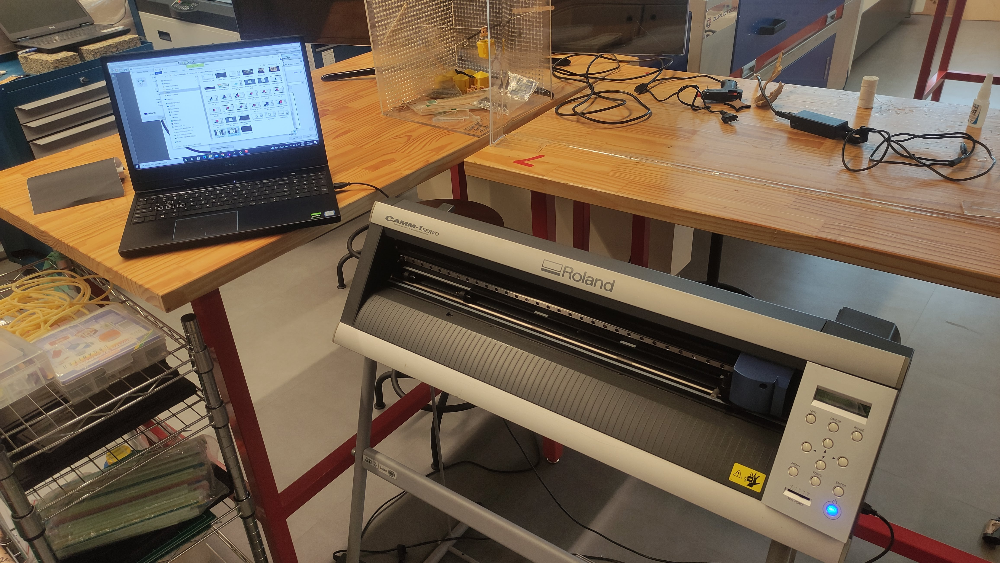{.center style="width:950px"}

&nbsp;

{.center style="width:950px"}

&nbsp;

Then I ran a routine in the machine called "piece" which makes the machine identify the material and display the dimension avaiable for cuts, what in this case was 114 x 157mm.

&nbsp;

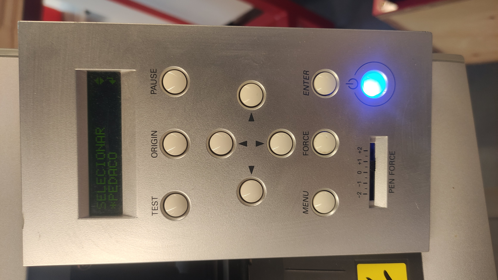{.center style="height:650px"} &nbsp;&nbsp;&nbsp; 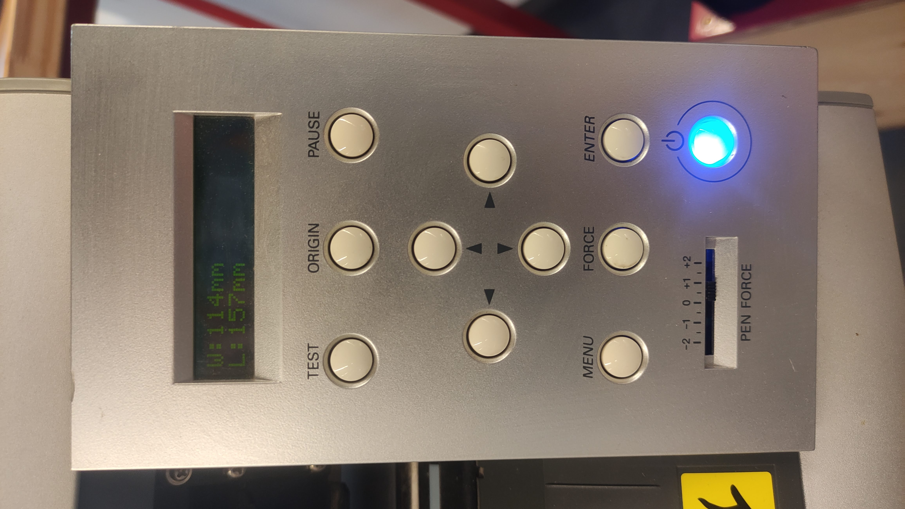{.center style="height:650px"}

&nbsp;
