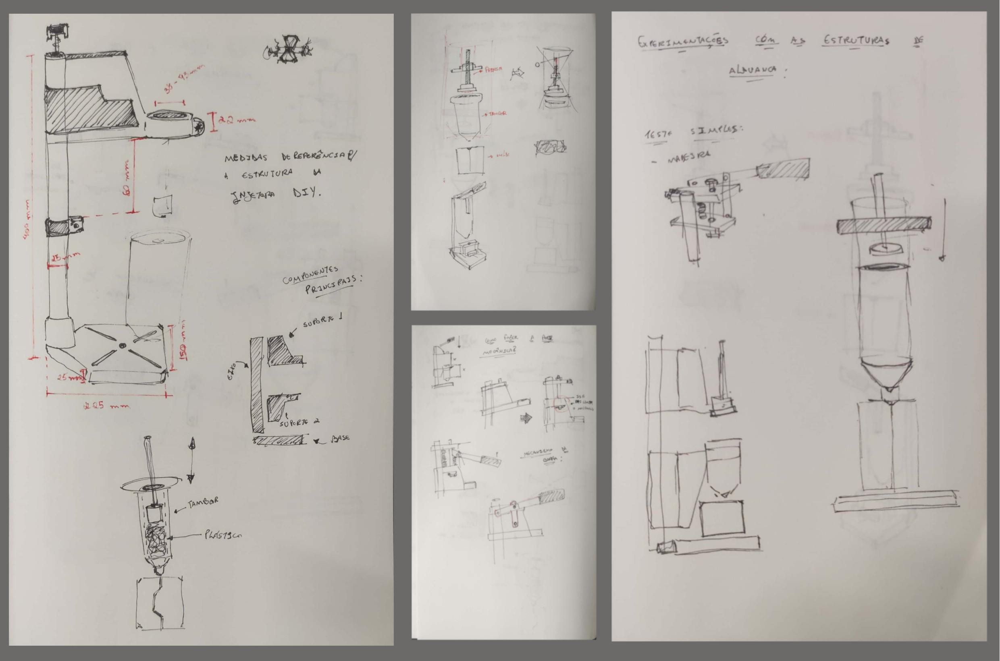

# 1. Principles and Practices

## The Assigment
&nbsp;

- Plan and sketch a potential final project.

&nbsp;

## An Obstacle On The Way 
&nbsp;

3D printers can be a great tool to create models and prototypes in polymers. In many cases we are able to perform structural tests on printed models with results very close to a molded part, evidencing the great efficiency of this technology when considering the development of products made in plastic injection. 

Unfortunately, characteristics of this production process like mold extraction vector tests for the mold, flexibility and textures of the molded part, as well as the finishing of the product cannot be validated with a 3D printed prototype. This is a scenery that happened with a few projects I was involved in 2020. The main obstacle I came across with those projects was when I had a 3D printed prototype that was tested and validated and the next step of the development was to start the tests with the injection mold. 

But at this point, it appeared a series of questions that should have been answered like:

- What resin I should use in the injection mold? Polypropylene (PP), polyethylene (PE) or polystyrene?  
- Will the molded part have the same performance, structurally, as the 3D printed part?
- Will it be more rigid or more flexible?
- Will the texture I designed for the product has the same feel as the printed part?
- Will it be possible to reproduce my design in an injection mold, or will I have to adjust it?

It was not possible to answer those questions in the Fab Lab, because we didnt have a proper equipment to prototype the process of injection mold. And it looked risky to order the production of a mold and to rent the use of a plastic injection molding machine when the big investment to do it is considered.

The big question came up then:

- Can I develop, in the Fab Lab, an equipment able to fulfill this need?

&nbsp;

### The Idea
&nbsp;

The answer for the previous question was, somehow, simple: the development of a mini injection mold machine.

Despite the simple answer, developing it would not be easy. But having a desktop injection mold machine that could work with reused plastics from packaging to create more faithful models of plastic products seemed very promising to me. Therefore, I chose this idea as an object of study and development for the Fab Academy course.

&nbsp;

### Who will use it? 
&nbsp;

My plan is using this new machine to equip the Insper Fab Lab where I work. It is expected that the Fab Lab users who want to develop projects with plastic parts will be able to use the equipment to aid in their development process. Using past difficulties during the development of projects in 2020 as a case, the main goal is having this equipment avaiable for other users who would be developing projects with plastic parts.

&nbsp;

## Final Project Concept
&nbsp;

To build the design for the injection mold machine, I chose to develop a structure similar to the bench drill stands. The main reference for this project is a DIY injection mold machine made by [Buster Beagle 3D](https://www.youtube.com/channel/UCzQXsDo_IF1EJodh3MGvUHw).

&nbsp;

<iframe width="560" height="315" src="https://www.youtube.com/embed/HoSVPHVESiE" title="YouTube video player" frameborder="0" allow="accelerometer; autoplay; clipboard-write; encrypted-media; gyroscope; picture-in-picture" allowfullscreen></iframe>

&nbsp;

.jpg){.centerGroup}  &nbsp;&nbsp;&nbsp; .jpg){.centerGroup} 

&nbsp;

I chose this structure because the alternative, a horizontal structure that consist in a thread responsible to inject the plastic, would demand a larger space to be occupied on the desk. By making this choice, I would restrict the size of the mold that could be used for injection. But it would not be a problem since it would still be possible to validate all the questions raised above. If the project demands a bigger mold, it would still be possible to prototype a scaled model of the developing part.

&nbsp;

### Ideation Sketches
&nbsp;

{.center .image}

&nbsp;

### Concept Sketch
&nbsp;

{.center style="height: 90vh"}

&nbsp;

## Problem Statement##
&nbsp;

It is to develop a desktop plastic injection machine in order to meet the need to create plastic prototypes that are more faithful to those that will be produced industrially, making it possible to resolve doubts regarding the development of the mold and the plastic resin to be used in the production.

&nbsp;

## Skills Required
&nbsp;

- 3D Modeling  
- 3D Printing 
- Woodworking
- 3D Machining
- Programming
- Eletronics Knowledge
- PCB Design

&nbsp;

