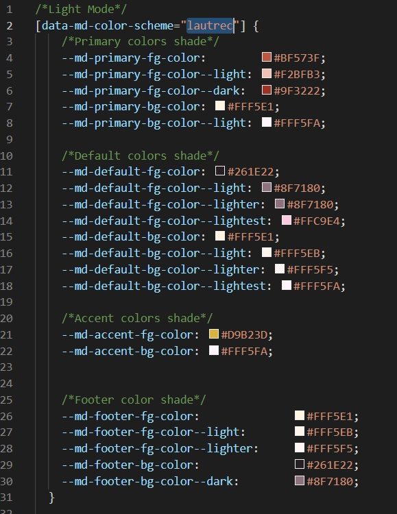
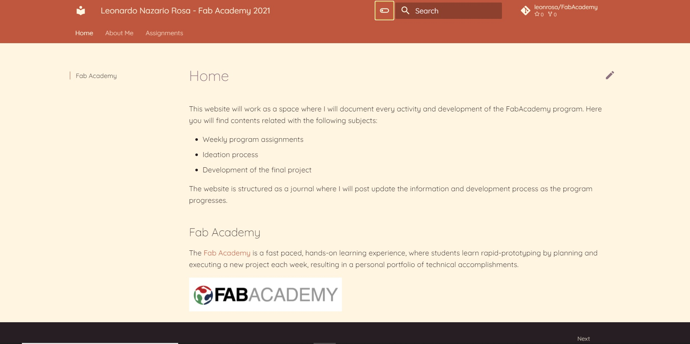

# 2. Project Management


## The Assignment
&nbsp;


- Build a personal website describing you and your final project.
- Work through a git tutorial.

&nbsp;

## Building the Website 
&nbsp;

To build my personal website for the final project documentation, I needed to learn a few tools and plataforms to make it possible. As my work team are also taking the Fab Academy course, we agreed to create a pattern for the projects documentation. And to do it, we researched and indentified the following needed tools to build the website:

- **Git**: An open-source version control system used for creating a history of changes in the source code of software's development project.
- **GitHub**: A remote repository hosting service workins as an online Git.
- **Markdown**: A "text-to-HTML conversion tool for web writers" according to Jon Gruber, its creator. It is a tool that allows writing using plain text, converting it to a valid XHTML structure..
- **Mkdocs**: A static website generator for building project documention. Its source files are written in Markdown and set in a single YAML configuration file.

Both Git and Github I already used a few times before. I learned a little about version control with Git and Github in a course on [Alura](https://www.alura.com.br/curso-online-git-github-controle-de-versao), a online courses platform. But I never used Markdown and Mkdocs before, despite having already heard about them. During the website building process I learned how to use them, discovering and testing about the functions, tools, etc.

My main reference to create the website was from my co-worker Eliana Rodrigues Martins, who started developing her [documentation](https://rmeliana.github.io/FabAcademy/) before me and already discovered how to navigate with those tools.

Following are the steps I took to create the documentation website for my Fab Academy projects.

### Installing Python, Git, Mkdocs and Materials for Mkdocs

*Operating System: Windows 10*

1. Download the most recent version of [Python](https://www.python.org/downloads/).
2. Install it. The instalation process is straight foward.
3. Repeat the same process with [Git](https://git-scm.com/downloads)
4. With Git installed, it will be able to access a terminal called **Git Bash**.
5. Open it and type the following command:

    ``` 

    $ python --version

    ```
    
6. If the installation process worked you should see the Python version installed, as shown bellow:

    ``` 

    $ python --version
    Python 3.8.2

    ```

7. Check if the [Pip](https://pypi.org/project/pip/) command is avaiable by typing the following:

    ``` 

    $ pip --version

    ```

8. If pip is installed, the terminal will return the following information:

    ``` 

    $ pip --version
    pip 21.1.2 from c:\program files\python39\lib\site-packages\pip (python 3.9)

    ```
    
     Usually Pip is installed with Python.

9. Now is time to install Mkdocs, using the following command in the terminal:

    ``` 

    $ pip install mkdocs

    ```

10. After the installation is done, it is going to be possible to start the website building. In the [Mkdocs website](https://www.mkdocs.org/) you can follow the first steps to prepare the documentation in your own static website. You cand find the guide in the [Getting Started](https://www.mkdocs.org/getting-started/) section.

    {style="width:950px"}

11. This guide will teach you how to create a new project as wel as adding pages, theming the documentation and using icons through the YAML configuration file.

    {style="width:950px"}

12. In my project, I used a theme called [Materials for Mkdocs](https://squidfunk.github.io/mkdocs-material/). Since it is a theme that does not come with Mkdocs, I needed to install it using the following line:

    ```
        $ pip install mkdocs-material
    ```

13. With the theme installed, I just needed to set the name **material** on the folowwing line in the mkdocs.yml file to use it.

    {style="width:950px"}

14. Write the following command line in the terminal to preview the new site with the Material theme:

    ```
        $ mkdocs serve
    ```

### Setting up the theme colors 

Material for Mkdocs allows the user to customize the colors of the theme. I followed the instuction found in the [Changing the color](https://squidfunk.github.io/mkdocs-material/setup/changing-the-colors/) section to customize my documentation site. Unfortunatly I could not identify myself with the color palette and with the combination options offered by the theme. Then I could discovered how to create my own color scheme. Here it is the steps to create your own color scheme:

1. At the [Changing the color](https://squidfunk.github.io/mkdocs-material/setup/changing-the-colors/) section, scroll down until you find the orientations about Custom colors and custom color schemes.

    {style="width:950px"}

2. Basically, you will have to add new colors in a **extra.css** located at *you-project-folder/docs/stylesheets. You will need to define the values of certain css variables to add new colors. To check out which variables are avaiable you can use the [color definition](https://github.com/squidfunk/mkdocs-material/blob/master/src/assets/stylesheets/main/_colors.scss) section.

3. Since the colors definition is set by hexadecimal code, I used the [Adobe Color](https://color.adobe.com/pt/create/color-wheel) to help me to set my color scheme. Adobe Color has a tool to extract the color palette from images. As a great fan from art noveau and Toulouse Lautrec, I defined my color scheme from the *Jane Avril* poster.

    {style="width:950px"} ![]

4. The tool returns the respective hexadecimal code values of the colors. With those informations, I configured my light and dark theme in the **extra.css** file like the image below:

    {style="height:600px"} {style="height:600px"}

5. With this file configured, my documentation site will looks like the one you are navigating now.

<center>
{style="height:350px"} {style="height:350px"}
</center>

### Deploying to Github and Automating the Process

Now it is time to deploy our website to GitHub, and finally have it online on the internet. To do it I followed the [Allithy Tutorial](https://allythy.github.io/como-criar-documentacao-com-mkdocs), more specifically in the "Deploy para o Github" section. With the tutorial, we are going to get a URL address for our documentation site. In my case the address was <https://leonrosa.github.io/FabAcademy/>.

Once the files are on the GitHub repository, everytime that we need to make an update we will need to repeat the deployment process. To make this step easier, I chose to automated following the [Parker Erickson tutorial](https://parkererickson.github.io/portfolio/blog/MkDocsCD/).

!!! Important "Install all dependencies before update the documentation."
    - Create the file 'requirement.txt' on the roof of the documentation main folder.
      
        <figure>
        {style="width:600px"}
        </figure>
    
    - Inside the file, write the following lines:
        ```
            mkdocs>=1.1
            mkdocs-material>=7.1
            Pygments>=2.4
            markdown>=3.2
            pymdown-extensions>=7.0
            mkdocs-material-extensions>=1.0
        ```
    - Finally, install them adding the following command in the YAML file found inside the 'my-project\ .github\workflows' folder:
        ```
           - name: Install dependencies
                run: |
                pip install -r requirements.txt
                pip install mkdocs-git-revision-date-plugin
        ```


## Code Editor and Terminal
&nbsp;

To build and develop my documentation website, I needed to use a code editor software. The software was needed to edit the YAML files and create the texts in [Markdown](https://www.markdownguide.org/).

In my documentation I chose the [Visual Studio Code](https://code.visualstudio.com/) to use, a Microsoft code editor.

I also needed to use the terminal to install and operate the Mkdocs server. Since I already used Linux before and I am used to its commands, I chose the Git Bash as my main terminal.

Besides my choice, the steps above can also be fulfilled with other code editors like [Notepad++](https://notepad-plus-plus.org/), [Atom](https://atom.io/) and [Sublime](https://www.sublimetext.com/) and/or with other terminals like the Command Prompt from Windows operating system.

&nbsp;

## References
&nbsp;

For more informations related with inserting images, code blocks, buttons, lists, etc. you can read the Material for Mkdocs [references](https://squidfunk.github.io/mkdocs-material/reference/images/).

But the informations in the link doesnt cover the information to add videos in the documentation. To do it I can follow two methods, one for Youtube videos and the other for videos files located in my computer.

The methods are:

!!! info "Videos"

    === "Youtube videos"

        1. Go to the Video page on YouTube and click on the Share Button.
        2. Choose Embed.
        3. Copy and Paste the HTML snippet in your markdown.

        Example:

        ```
        <center>
        <iframe width="560" height="315" src="https://www.youtube.com/embed/l4gGWufoIYI" title="YouTube video player" frameborder="0" allow="accelerometer; autoplay; clipboard-write; encrypted-media; gyroscope; picture-in-picture" allowfullscreen></iframe>
        </center>

        ```
        Result:

        <center>
        <iframe width="560" height="315" src="https://www.youtube.com/embed/l4gGWufoIYI" title="YouTube video player" frameborder="0" allow="accelerometer; autoplay; clipboard-write; encrypted-media; gyroscope; picture-in-picture" allowfullscreen></iframe>
        </center>

    === "Local videos"

        To add a local video in the documentation site, we can do it through a issue in GitHub. But the video will be restricted to until 10MB, what does it mean that the video need to be short to be uploaded Then copy the address video and paste into your file like the code below. For more details about visit this [site](https://medium.com/@jackywangdeveloper/tips-tricks-how-to-add-a-demo-video-in-your-git-readme-md-bbf8376a4b74).

        ```
        <center>
        <video controls width="385">

            <source src="the-address-video">

        </video>
        </center>

        ```
